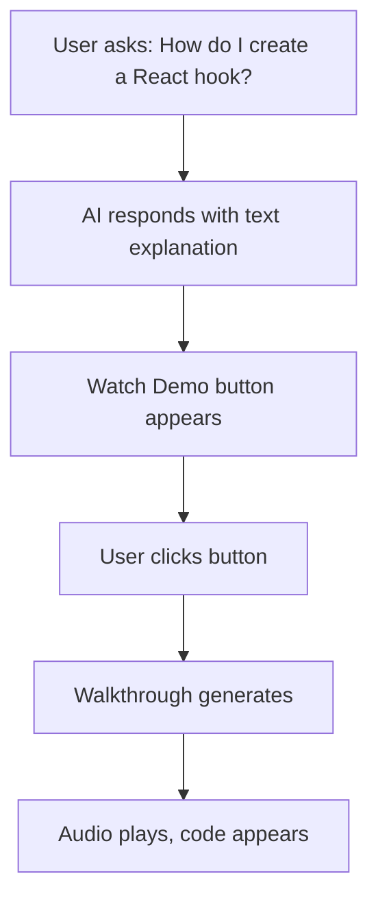
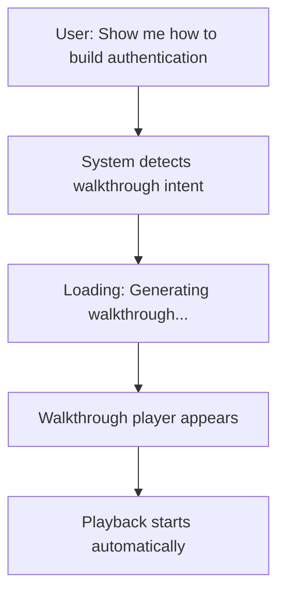
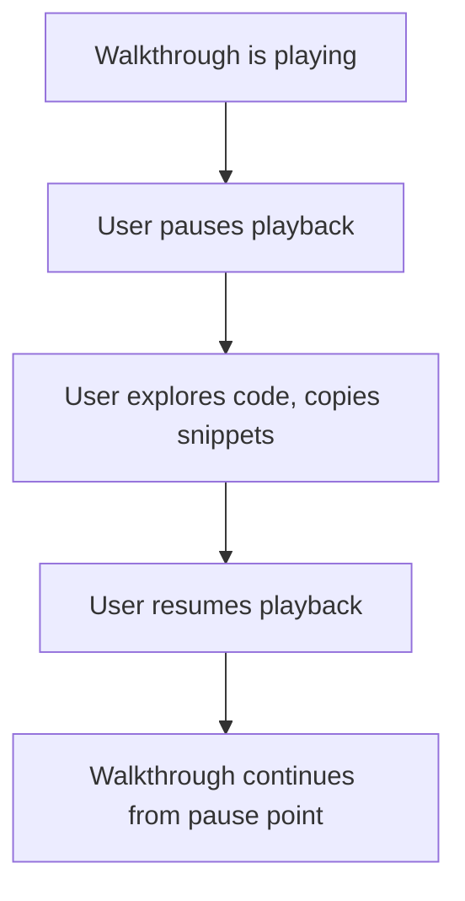
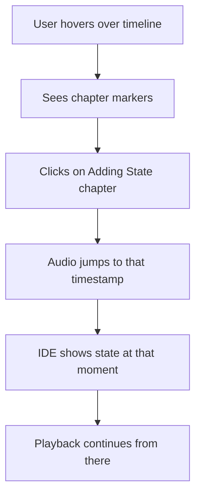

## What is Walkthrough Mode?

Walkthrough Mode is VSpeak's signature feature: an **AI-generated, audio-synchronized coding demonstration** where the AI explains concepts while code appears in the editor in real-time.

Think of it as having a personal coding tutor who:
- Speaks and explains concepts
- Types code while narrating what they're doing
- Creates files and runs terminal commands
- Lets you pause, rewind, and jump to specific sections

## Two Operating Modes

VSpeak operates in two distinct modes:

### Normal Mode (Interactive Chat)

Standard AI assistant experience:
- User chats with the AI in the sidebar
- AI can read files, write code, run terminal commands
- User maintains control, AI assists
- Similar to Cursor's Composer or GitHub Copilot Chat

**Example interaction:**

```
User: "Add a login form to the homepage"

AI: "I'll add a login form component. Here's what I'm creating:
    
    // components/LoginForm.jsx
    export function LoginForm() {
      return (
        <form>
          <input type="email" placeholder="Email" />
          <input type="password" placeholder="Password" />
          <button type="submit">Login</button>
        </form>
      );
    }
    
    I've created the file and imported it into your homepage."
```

### Walkthrough Mode (Audio-Visual Tutorial)

When the user wants to **see** how something is done:
- AI generates a narrated script
- Script is converted to audio (TTS)
- Audio is synchronized with IDE actions
- User watches the AI "drive" the IDE while explaining

**Triggering Walkthrough Mode:**

<CodeGroup>
```text User Prompts
"Show me how to..."
"Walk me through..."
"Demonstrate..."
"Explain how to build..."
```

```typescript Programmatic Trigger
// In chat request
const request = {
  message: "Build a React component",
  generate_walkthrough: true
};
```
</CodeGroup>

## How Walkthrough Mode Works

### The User Experience

1. **Request**: User asks for a demonstration
2. **Generation**: AI generates the walkthrough (15-30 seconds)
3. **Playback**: Audio-visual demonstration begins
4. **Control**: User can pause, seek, and jump to chapters
5. **Exploration**: User can pause to inspect code and copy snippets

### What Happens During Playback

As the audio plays, the IDE comes to life:

```typescript
// Timeline actions execute in sync with audio
[
  { timeMs: 1200, kind: 'create_file', path: 'App.jsx' },
  { timeMs: 2500, kind: 'type', text: 'import React from "react";' },
  { timeMs: 8400, kind: 'terminal_run', command: 'npm start' },
  { timeMs: 12000, kind: 'highlight_range', startLine: 5, endLine: 8 }
]
```

**Visual Indicators**:
- Terminal shows a pulsing indicator when playback is active
- Code types character-by-character (configurable speed)
- Cursor moves to relevant positions
- Code sections highlight to draw attention

## IDE Actions

Walkthrough mode can perform these actions in the IDE:

| Action | Description | Example |
|--------|-------------|----------|
| `create_file` | Create a new file | Create `components/Button.tsx` |
| `type_code` | Type code character by character | Type function definition |
| `switch_tab` | Switch to a different file | Switch to `index.html` |
| `move_cursor` | Move cursor position | Move to line 10, column 5 |
| `highlight` | Highlight lines of code | Highlight lines 5-8 |
| `terminal_command` | Run a terminal command | `npm install react` |
| `run_code` | Execute the code | `node app.js` |
| `show_output` | Display output in terminal | Show "Server running..." |

### Action Timing

Each action is scheduled to execute at a precise moment in the audio:

```json
{
  "type": "type_code",
  "timestamp_ms": 5420,
  "trigger_word": "function",
  "params": {
    "content": "function greet(name) {",
    "speed": "medium"
  }
}
```

When the audio reaches 5.42 seconds (around the word "function"), the typing action begins.

## Chapters and Navigation

Walkthroughs are divided into logical chapters, similar to YouTube videos:

```json
{
  "chapters": [
    {
      "title": "Introduction",
      "description": "Overview of what we'll build",
      "start_ms": 0,
      "end_ms": 15000
    },
    {
      "title": "Setting Up the File",
      "description": "Creating our main component file",
      "start_ms": 15000,
      "end_ms": 35000
    },
    {
      "title": "Adding State",
      "description": "Using useState for interactivity",
      "start_ms": 35000,
      "end_ms": 58000
    }
  ]
}
```

### Chapter Features

- **Visual markers** on the audio timeline
- **Hover tooltip** shows chapter title and description
- **Click to jump** to any chapter instantly
- **State restoration** when seeking (see below)

## Seeking and State Management

### The Challenge

When a user seeks to a different point in the audio, the IDE must show the **correct state** at that moment.

For example, if the user jumps to minute 2:
- Which files exist?
- What's the content of each file?
- Which file is open in the editor?
- What's the terminal output so far?

### The Solution: State Snapshots

Each chapter stores a snapshot of the IDE state:

```typescript
interface IDEStateSnapshot {
  files: Record<string, string>;  // filename -> content
  open_tabs: string[];            // which files are open
  active_file: string;            // currently focused file
  cursor_position: { line: number; column: number };
  terminal_output: string[];
}
```

### Seeking Algorithm

```typescript
function handleSeek(timeMs: number) {
  // 1. Find the target chapter
  const chapter = chapters.find(ch => 
    timeMs >= ch.start_ms && timeMs < ch.end_ms
  );
  
  // 2. Reset the editor to empty state
  executor.reset();
  
  // 3. Restore chapter snapshot (if exists)
  if (chapter?.snapshot) {
    restoreSnapshot(chapter.snapshot);
  }
  
  // 4. Apply actions between chapter start and seek position
  executor.beginBatch();
  for (const action of scheduler.getActions()) {
    if (action.timeMs > timeMs) break;
    if (action.timeMs >= chapter.start_ms) {
      executor.execute(action);
    }
  }
  executor.endBatch();
  
  // 5. Update scheduler to resume from this point
  scheduler.primeAfter(timeMs);
}
```

**Implementation**: `web/src/App.tsx:356`

## User Flows

### Flow 1: Chat First, Demo Later



### Flow 2: Direct Walkthrough Request



### Flow 3: Pause and Explore



### Flow 4: Chapter Navigation



## Technical Implementation

### Frontend Components

```typescript
// Main App orchestrates the walkthrough
function App() {
  const [currentWalkthrough, setCurrentWalkthrough] = useState(null);
  const [isPlaying, setIsPlaying] = useState(false);
  
  const executorRef = useRef<ActionExecutor>(null);
  const schedulerRef = useRef<TimelineScheduler>(null);
  
  // Initialize action executor
  useEffect(() => {
    executorRef.current = new ActionExecutor({
      onFileOpened: (path) => setActiveFile(path),
      onFileCreated: (path) => addToFileList(path)
    });
  }, []);
  
  // Create scheduler when walkthrough loads
  useEffect(() => {
    if (!currentWalkthrough) return;
    
    const audioEl = document.querySelector('audio');
    schedulerRef.current = new TimelineScheduler({
      audio: audioEl,
      actions: currentWalkthrough.actions,
      callbacks: {
        onAction: (action) => executorRef.current.execute(action),
        onComplete: () => setIsPlaying(false)
      }
    });
  }, [currentWalkthrough]);
}
```

**Full implementation**: `web/src/App.tsx`

### Backend Generation

```python
@app.post("/api/walkthrough/generate")
async def generate_walkthrough(request: WalkthroughGenerateRequest):
    """Generate a new walkthrough from a prompt"""
    # Create unique session directory
    session_id = str(uuid.uuid4())
    output_dir = SESSIONS_DIR / session_id
    
    # Run the pipeline (LLM → TTS → STT → Sync)
    result = run_pipeline(request.prompt, output_dir)
    
    # Create walkthrough session
    walkthrough = WalkthroughSession(
        id=session_id,
        title=request.prompt[:50],
        audio_path=str(result.audio_path),
        actions=result.synced_actions,
        chapters=result.script.chapters,
        duration_ms=int(result.metrics.total_ms)
    )
    
    # Store and return
    walkthroughs[session_id] = walkthrough
    return WalkthroughResponse(
        walkthrough=walkthrough,
        audio_url=f"/api/walkthrough/{session_id}/audio"
    )
```

**Full implementation**: `backend/server.py:455`

## Performance Considerations

### Generation Time

Total walkthrough generation typically takes 15-30 seconds:

- **Script generation** (GLM 4.7): ~2-5 seconds
- **Audio generation** (Gemini TTS): ~5-10 seconds
- **Timestamp extraction** (Whisper): ~3-8 seconds
- **Action synchronization**: &lt;1 second

### Playback Performance

The Timeline Scheduler uses `requestAnimationFrame` for smooth action execution:

```typescript
private tick(): void {
  const nowMs = this.audio.currentTime * 1000;
  
  // Fire all actions scheduled for this frame
  while (this.pointer < this.actions.length) {
    const next = this.actions[this.pointer];
    if (next.timeMs - this.toleranceMs <= nowMs) {
      this.callbacks.onAction(next);
      this.pointer += 1;
    } else {
      break;
    }
  }
  
  this.scheduleNextFrame();
}
```

**Tolerance**: Actions are fired if they're within 16ms (one frame) of their scheduled time.

## Key Differentiators

What makes VSpeak's Walkthrough Mode unique:

1. **Audio-Synced Actions**: Code appears exactly when the AI mentions it
2. **Chapter Navigation**: Jump around like a YouTube video
3. **State Snapshots**: IDE always shows correct state when seeking
4. **Real Files**: Works with actual files on disk, not simulations
5. **Dual Mode**: Chat for quick help, Walkthrough for deep learning
6. **Expressive Speech**: AI uses different tones for engaging narration

## Next Steps

<CardGroup cols={2}>
  <Card title="Pipeline" icon="diagram-project" href="/concepts/pipeline">
    Learn how walkthroughs are generated
  </Card>
  <Card title="Synchronization" icon="clock" href="/concepts/synchronization">
    Understand audio-action timing
  </Card>
</CardGroup>
