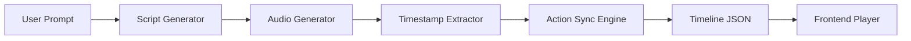
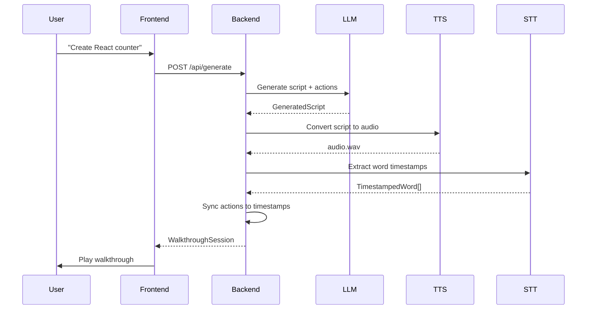
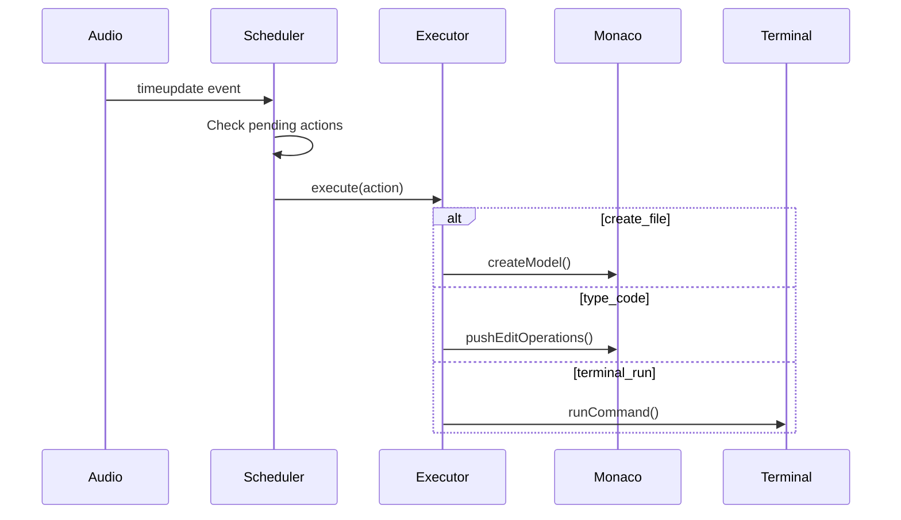

## Overview

VSpeak uses a **4-stage pipeline architecture** that transforms a user prompt into a synchronized audio-visual coding walkthrough. Every component is designed to be **swappable** and **provider-agnostic**.



## Core Design Principles

<CardGroup cols={2}>
  <Card title="Modularity" icon="cube">
    Each pipeline stage is independent. Swap LLM, TTS, or STT providers without touching other code.
  </Card>
  <Card title="Provider Agnostic" icon="plug">
    No hard dependencies on specific AI services. Use OpenAI, Anthropic, Gemini, or any other provider.
  </Card>
  <Card title="Single Clock" icon="clock">
    Audio element is the master timeline. All IDE actions are synchronized to `audio.currentTime`.
  </Card>
  <Card title="Deterministic Playback" icon="repeat">
    Seeking reconstructs exact IDE state. No drift, no async race conditions.
  </Card>
</CardGroup>

## Pipeline Stages

### Stage 1: Script Generation

**File:** `backend/pipeline/script_generator.py`

**Purpose:** Convert user prompt into structured script with IDE actions

**Input:**
```python
user_prompt: str  # e.g., "Create a React counter component"
```

**Output:**
```python
class GeneratedScript(BaseModel):
    chunks: list[ScriptChunk]       # Pre-chunked text (100-150 chars)
    chapters: list[Chapter]         # Timeline markers
```

**Key Concepts:**

<AccordionGroup>
  <Accordion title="Script Chunks">
    Text is pre-divided into 100-150 character chunks for TTS models with length limits. Each chunk includes:
    - `text`: Narration with optional vocal directions like `[cheerful]`
    - `actions`: List of IDE actions to perform during this chunk
  </Accordion>

  <Accordion title="Actions">
    Each action has:
    - `type`: Action kind (create_file, type_code, etc.)
    - `trigger_word`: Word in script that triggers this action
    - `params`: Action-specific parameters

    Example:
    ```json
    {
      "type": "create_file",
      "trigger_word": "create",
      "params": { "path": "Counter.tsx" }
    }
    ```
  </Accordion>

  <Accordion title="Chapters">
    Divide the walkthrough into logical sections (like YouTube chapters):
    - `title`: Chapter name
    - `start_chunk_index` / `end_chunk_index`: Chunk range
    - `start_ms` / `end_ms`: Populated after audio generation
  </Accordion>
</AccordionGroup>

**Provider Interface:**
```python
class ScriptGenerator:
    def __init__(self):
        self.client = CerebrasClient()  # Swappable!
    
    def generate(self, user_prompt: str) -> tuple[GeneratedScript, float]:
        script, latency = self.client.generate_script(prompt, system_prompt)
        return script, latency
```

<Tip>
  Any LLM that can follow instructions and output JSON can be used here. See [Adding Providers](/development/adding-providers#adding-an-llm-provider).
</Tip>

---

### Stage 2: Audio Generation

**Files:** 
- `backend/pipeline/audio_generator.py` (chunked TTS)
- `backend/pipeline/gemini_audio_generator.py` (long-form TTS)

**Purpose:** Convert script text to expressive speech audio

**Two Strategies:**

<CodeGroup>
```python Chunked TTS (Orpheus)
# For models with length limits
class AudioGenerator:
    def generate_audio(self, script: GeneratedScript) -> tuple[Path, list[float], float]:
        # Generate each chunk in parallel
        with ThreadPoolExecutor(max_workers=3) as executor:
            futures = {
                executor.submit(self._generate_chunk, i, chunk.text): i
                for i, chunk in enumerate(script.chunks)
            }
        
        # Stitch with silence padding
        self._stitch_audio_files(chunk_files, output_path)
        
        return audio_path, chunk_latencies, stitch_time
```

```python Long-form TTS (Gemini)
# For models that handle full scripts
class GeminiAudioGenerator:
    def generate_audio(self, script: GeneratedScript) -> tuple[Path, list[float], float]:
        # Single API call with full text
        full_text = " ".join(chunk.text for chunk in script.chunks)
        
        response = self.client.models.generate_content(
            model="gemini-2.5-flash-preview-tts",
            contents=full_text,
            config={"response_modalities": ["AUDIO"]}
        )
        
        return audio_path, [latency], 0
```
</CodeGroup>

**Configuration:**
```python
# backend/config.py
TTS_PROVIDER = "gemini"  # or "orpheus"

# Pipeline automatically selects the right generator:
if provider == "gemini":
    audio_gen = GeminiAudioGenerator(output_dir)
else:
    audio_gen = AudioGenerator(output_dir)
```

---

### Stage 3: Timestamp Extraction

**File:** `backend/pipeline/timestamp_extractor.py`

**Purpose:** Extract word-level timestamps for action synchronization

**Input:** Audio file (WAV)

**Output:**
```python
class TimestampedWord(BaseModel):
    word: str
    start_ms: int  # When this word starts
    end_ms: int    # When this word ends
```

**Implementation:**
```python
class TimestampExtractor:
    def __init__(self):
        self.client = GroqSTTClient()  # Uses Whisper
    
    def extract_timestamps(self, audio_path: Path) -> tuple[list[TimestampedWord], float]:
        with open(audio_path, "rb") as f:
            transcription = self.client.transcribe_with_timestamps(f)
        
        # Parse word-level timestamps
        timestamps = [
            TimestampedWord(
                word=word_data.word,
                start_ms=int(word_data.start * 1000),
                end_ms=int(word_data.end * 1000)
            )
            for word_data in transcription.words
        ]
        
        return timestamps, latency
```

<Note>
  Any STT service that provides word-level timestamps can be used. Groq's Whisper, Deepgram, and AssemblyAI all support this.
</Note>

---

### Stage 4: Action Synchronization

**File:** `backend/pipeline/action_sync.py`

**Purpose:** Map each action's trigger word to its exact timestamp

**Algorithm:**
```python
class ActionSyncEngine:
    def sync_actions(self, script: GeneratedScript, timestamps: list[TimestampedWord]) -> list[SyncedAction]:
        synced_actions = []
        last_timestamp_ms = 0
        
        for chunk in script.chunks:
            for action in chunk.actions:
                trigger = action.trigger_word.lower()
                
                # Find trigger word in timestamps (after last match)
                for ts in timestamps:
                    word_clean = ts.word.lower().strip('.,!?;:\'')
                    
                    if word_clean == trigger and ts.start_ms >= last_timestamp_ms:
                        synced_actions.append(SyncedAction(
                            type=action.type,
                            timestamp_ms=ts.start_ms,
                            trigger_word=action.trigger_word,
                            params=action.params
                        ))
                        last_timestamp_ms = ts.start_ms
                        break
        
        return synced_actions
```

**Output JSON:**
```json
{
  "total_actions": 12,
  "actions": [
    {
      "type": "create_file",
      "timestamp_ms": 2450,
      "trigger_word": "create",
      "params": { "path": "Counter.tsx" }
    },
    {
      "type": "type_code",
      "timestamp_ms": 5120,
      "trigger_word": "import",
      "params": { "content": "import React from 'react';" }
    }
  ]
}
```

---

## Frontend Architecture

### Component Hierarchy

```
App.tsx
├── WalkthroughPlayer
│   ├── ChapterTimeline
│   ├── AudioPlayer (HTML5 <audio>)
│   └── ProgressBar
├── Monaco Editor
│   └── ActionExecutor
│       ├── VirtualFileSystem
│       └── HighlightManager
├── TerminalController (Xterm.js)
└── ChatPanel
```

### Timeline Scheduler

**File:** `web/src/timeline/scheduler.ts`

**Purpose:** Execute actions in sync with audio playback

**Key Mechanism:**
```typescript
class TimelineScheduler {
  private audioElement: HTMLAudioElement;
  private actions: TimelineAction[];
  private executedUpTo = 0;

  tick() {
    const currentMs = this.audioElement.currentTime * 1000;
    
    // Execute all actions up to current time
    while (this.executedUpTo < this.actions.length) {
      const action = this.actions[this.executedUpTo];
      
      if (action.timestamp_ms <= currentMs) {
        this.executor.execute(action);
        this.executedUpTo++;
      } else {
        break;  // Future actions not yet ready
      }
    }
  }
  
  seek(timeMs: number) {
    // Rebuild IDE state from scratch
    this.executor.reset();
    this.executedUpTo = 0;
    
    this.executor.beginBatch();  // Fast mode: no animations
    
    for (let i = 0; i < this.actions.length; i++) {
      if (this.actions[i].timestamp_ms <= timeMs) {
        this.executor.execute(this.actions[i]);
        this.executedUpTo = i + 1;
      } else {
        break;
      }
    }
    
    this.executor.endBatch();
  }
}
```

<Tip>
  The single-clock architecture means seeking is **deterministic**. No matter how many times you jump to 1:23, the IDE state will be identical.
</Tip>

### Action Executor

**File:** `web/src/editor/actionExecutor.ts`

**Supported Actions:**

<AccordionGroup>
  <Accordion title="create_file">
    Creates a new file in the virtual filesystem and opens it in Monaco.
    ```typescript
    execute({ kind: 'create_file', path: 'app.js', content: '' })
    ```
  </Accordion>

  <Accordion title="type_code">
    Types code into the current file, character by character.
    ```typescript
    execute({ 
      kind: 'type', 
      path: 'app.js', 
      text: 'console.log("Hello");',
      charactersPerSecond: 30  // Optional typing animation
    })
    ```
  </Accordion>

  <Accordion title="move_cursor">
    Moves the editor cursor to a specific line/column.
    ```typescript
    execute({ kind: 'move_cursor', path: 'app.js', line: 5, column: 10 })
    ```
  </Accordion>

  <Accordion title="highlight_range">
    Highlights a code region for emphasis.
    ```typescript
    execute({ 
      kind: 'highlight_range', 
      path: 'app.js',
      range: { startLine: 3, startColumn: 1, endLine: 5, endColumn: 20 },
      durationMs: 2000
    })
    ```
  </Accordion>

  <Accordion title="terminal_run">
    Executes a command in the terminal.
    ```typescript
    execute({ kind: 'terminal_run', command: 'npm install' })
    ```
  </Accordion>

  <Accordion title="terminal_output">
    Displays output in the terminal.
    ```typescript
    execute({ kind: 'terminal_output', text: 'Build successful!' })
    ```
  </Accordion>
</AccordionGroup>

---

## Data Flow

### Generation Flow



### Playback Flow



---

## Configuration System

**File:** `backend/config.py`

**Provider Selection:**
```python
# LLM Configuration
CEREBRAS_MODEL = "zai-glm-4.7"
CEREBRAS_BASE_URL = "https://api.cerebras.ai/v1"

# TTS Provider: "orpheus" or "gemini"
TTS_PROVIDER = "gemini"

# Orpheus TTS (Groq)
ORPHEUS_TTS_MODEL = "canopylabs/orpheus-v1-english"
ORPHEUS_TTS_VOICE = "austin"

# Gemini TTS
GEMINI_TTS_MODEL = "gemini-2.5-flash-preview-tts"
GEMINI_TTS_VOICE = "Kore"

# STT Configuration
STT_MODEL = "whisper-large-v3-turbo"
```

**Audio Processing:**
```python
# Chunk sizes for script generation
MIN_CHUNK_LENGTH = 100
MAX_CHUNK_LENGTH = 150

# Audio stitching (for chunked TTS)
CROSSFADE_DURATION_MS = 50
SILENCE_PADDING_MS = 150
SAMPLE_RATE = 24000
```

---

## Next Steps

<CardGroup cols={2}>
  <Card title="Adding Providers" icon="plug" href="/development/adding-providers">
    Integrate new LLM, TTS, or STT services
  </Card>
  <Card title="Extending Actions" icon="code" href="/development/extending-actions">
    Create custom IDE action types
  </Card>
</CardGroup>
