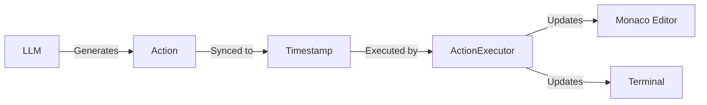

## Overview

VSpeak's action system is **fully extensible**. You can add new action types to support:

- Custom editor operations (refactoring, searching, etc.)
- External tool integrations (debuggers, databases, etc.)
- Visual effects (annotations, diagrams, etc.)
- Multi-file operations (project scaffolding, etc.)

This guide shows you how to add actions end-to-end, from backend generation to frontend execution.

---

## Action System Architecture



### Action Lifecycle

<Steps>
  <Step title="Definition">
    Add action type to `backend/models/types.py`
  </Step>
  <Step title="Generation">
    LLM includes action in script with trigger word
  </Step>
  <Step title="Synchronization">
    Action synced to trigger word timestamp
  </Step>
  <Step title="Execution">
    Frontend executes action at precise time
  </Step>
</Steps>

---

## Built-in Action Types

VSpeak ships with these actions:

<AccordionGroup>
  <Accordion title="create_file" icon="file-plus">
    Creates a new file in the virtual filesystem.
    
    ```json
    {
      "type": "create_file",
      "trigger_word": "create",
      "params": {
        "path": "components/Button.tsx",
        "content": ""  // Optional initial content
      }
    }
    ```
  </Accordion>

  <Accordion title="type_code" icon="keyboard">
    Types code into the current file.
    
    ```json
    {
      "type": "type_code",
      "trigger_word": "import",
      "params": {
        "content": "import React from 'react';",
        "speed": "medium"  // slow, medium, fast
      }
    }
    ```
  </Accordion>

  <Accordion title="switch_tab" icon="arrow-right-arrow-left">
    Switches to a different file.
    
    ```json
    {
      "type": "switch_tab",
      "trigger_word": "open",
      "params": {
        "target": "styles.css"
      }
    }
    ```
  </Accordion>

  <Accordion title="move_cursor" icon="arrow-pointer">
    Moves the editor cursor.
    
    ```json
    {
      "type": "move_cursor",
      "trigger_word": "line",
      "params": {
        "line": 10,
        "column": 5
      }
    }
    ```
  </Accordion>

  <Accordion title="highlight" icon="highlighter">
    Highlights code for emphasis.
    
    ```json
    {
      "type": "highlight",
      "trigger_word": "notice",
      "params": {
        "start_line": 5,
        "end_line": 8
      }
    }
    ```
  </Accordion>

  <Accordion title="terminal_command" icon="terminal">
    Runs a terminal command.
    
    ```json
    {
      "type": "terminal_command",
      "trigger_word": "install",
      "params": {
        "command": "npm install react"
      }
    }
    ```
  </Accordion>

  <Accordion title="show_output" icon="monitor">
    Displays output/results.
    
    ```json
    {
      "type": "show_output",
      "trigger_word": "output",
      "params": {
        "content": "Build successful!"
      }
    }
    ```
  </Accordion>
</AccordionGroup>

---

## Adding a New Action Type

### Example: Adding "search_and_replace"

Let's add an action that finds and replaces text in the current file.

<Steps>
  <Step title="Update the data model">
    In `backend/models/types.py`, add the new action type to the `Literal` union:

    ```python
    class Action(BaseModel):
        """Represents an action to be performed in the IDE"""
        type: Literal[
            "create_file",
            "type_code", 
            "switch_tab",
            "delete",
            "move_cursor",
            "scroll",
            "highlight",
            "terminal_command",
            "run_code",
            "show_output",
            "search_and_replace"  # <-- Add this
        ]
        trigger_word: str = Field(description="Word in script that triggers action")
        params: dict[str, Any] = Field(default_factory=dict)
    ```
  </Step>

  <Step title="Update configuration">
    In `backend/config.py`, add to the action types list:

    ```python
    ACTION_TYPES = [
        "create_file",
        "type_code",
        "switch_tab",
        "delete",
        "move_cursor",
        "scroll",
        "highlight",
        "terminal_command",
        "run_code",
        "show_output",
        "search_and_replace"  # <-- Add this
    ]
    ```
  </Step>

  <Step title="Update the system prompt">
    In `backend/pipeline/script_generator.py`, document the new action:

    ```python
    SYSTEM_PROMPT = """...
    
    ## ACTION TYPES
    
    - `search_and_replace`: Find and replace text
      - params: { "find": "old text", "replace": "new text" }
    
    ..."""
    ```
  </Step>

  <Step title="Add frontend type">
    In `web/src/timeline/types.ts`, add the action interface:

    ```typescript
    export interface SearchAndReplaceAction extends BaseAction {
      kind: 'search_and_replace';
      path: string;  // File to search in
      find: string;
      replace: string;
      replaceAll?: boolean;  // Replace all occurrences?
    }
    
    export type TimelineAction = 
      | CreateFileAction
      | TypeAction
      | MoveCursorAction
      | HighlightRangeAction
      | TerminalRunAction
      | TerminalOutputAction
      | ClearTerminalAction
      | SearchAndReplaceAction;  // <-- Add this
    ```
  </Step>

  <Step title="Implement execution logic">
    In `web/src/editor/actionExecutor.ts`, add the handler:

    ```typescript
    execute(action: TimelineAction) {
      switch (action.kind) {
        case 'create_file': {
          this.fs.createFile(action.path, action.content ?? '');
          const model = this.fs.openFile(action.path);
          this.openModel(model, action.path);
          break;
        }
        // ... other cases ...
        
        case 'search_and_replace': {  // <-- Add this
          this.applySearchAndReplace(action);
          break;
        }
        
        default: {
          const neverAction: never = action;
          console.warn('Unhandled action', neverAction);
        }
      }
    }
    
    private applySearchAndReplace(action: SearchAndReplaceAction) {
      const model = this.ensureFileOpen(action.path);
      if (!model || !this.editor || !this.monacoInstance) {
        return;
      }
      
      // Find all matches
      const matches = model.findMatches(
        action.find,
        true,  // searchOnlyEditableRange
        false, // isRegex
        true,  // matchCase
        null,  // wordSeparators
        true   // captureMatches
      );
      
      if (matches.length === 0) {
        console.warn(`No matches found for "${action.find}"`);
        return;
      }
      
      // Build edit operations
      const edits = matches
        .slice(0, action.replaceAll ? undefined : 1)
        .map(match => ({
          range: match.range,
          text: action.replace,
          forceMoveMarkers: true
        }));
      
      // Apply edits
      model.pushEditOperations([], edits, () => null);
      
      // Move cursor to first replacement
      if (edits.length > 0) {
        const firstRange = matches[0].range;
        this.editor.setPosition(firstRange.getStartPosition());
        this.editor.revealPositionInCenter(
          firstRange.getStartPosition(),
          this.monacoInstance.editor.ScrollType.Smooth
        );
      }
    }
    ```
  </Step>
</Steps>

### Testing Your New Action

<Steps>
  <Step title="Create a test script">
    ```bash
    cd backend
    python main.py --prompt "Create a file called test.js with console.log('hello'), then replace hello with world"
    ```
  </Step>

  <Step title="Check generated actions">
    ```bash
    cat output/actions.json
    ```
    
    Should contain:
    ```json
    {
      "type": "search_and_replace",
      "timestamp_ms": 3450,
      "trigger_word": "replace",
      "params": {
        "find": "hello",
        "replace": "world"
      }
    }
    ```
  </Step>

  <Step title="Test in the UI">
    Open `http://localhost:3000`, load the walkthrough, and verify the search-replace executes correctly.
  </Step>
</Steps>

---

## Advanced Examples

### Multi-step Action: "refactor_to_function"

Extract selected code into a new function:

<CodeGroup>
```typescript Type Definition
export interface RefactorToFunctionAction extends BaseAction {
  kind: 'refactor_to_function';
  path: string;
  selection: {
    startLine: number;
    startColumn: number;
    endLine: number;
    endColumn: number;
  };
  functionName: string;
  insertAt: {
    line: number;
    column: number;
  };
}
```

```typescript Executor Implementation
private applyRefactorToFunction(action: RefactorToFunctionAction) {
  const model = this.ensureFileOpen(action.path);
  if (!model || !this.editor || !this.monacoInstance) return;
  
  // 1. Get selected text
  const range = new this.monacoInstance.Range(
    action.selection.startLine,
    action.selection.startColumn,
    action.selection.endLine,
    action.selection.endColumn
  );
  const selectedText = model.getValueInRange(range);
  
  // 2. Create function definition
  const functionDef = `function ${action.functionName}() {\n${selectedText}\n}\n\n`;
  
  // 3. Insert function at specified location
  const insertRange = new this.monacoInstance.Range(
    action.insertAt.line,
    action.insertAt.column,
    action.insertAt.line,
    action.insertAt.column
  );
  
  // 4. Replace selection with function call
  const functionCall = `${action.functionName}();`;
  
  model.pushEditOperations(
    [],
    [
      { range: insertRange, text: functionDef },
      { range, text: functionCall }
    ],
    () => null
  );
  
  // 5. Move cursor to function definition
  this.editor.setPosition({
    lineNumber: action.insertAt.line,
    column: action.insertAt.column
  });
}
```
</CodeGroup>

### Visual Effect: "show_tooltip"

Display an informational tooltip:

<CodeGroup>
```typescript Type Definition
export interface ShowTooltipAction extends BaseAction {
  kind: 'show_tooltip';
  path: string;
  position: { line: number; column: number };
  message: string;
  durationMs?: number;
}
```

```typescript Executor Implementation
private applyShowTooltip(action: ShowTooltipAction) {
  const model = this.ensureFileOpen(action.path);
  if (!model || !this.editor || !this.monacoInstance) return;
  
  const position = new this.monacoInstance.Position(
    action.position.line,
    action.position.column
  );
  
  // Monaco's content widget API
  const tooltipWidget = {
    getId: () => `tooltip-${Date.now()}`,
    getDomNode: () => {
      const node = document.createElement('div');
      node.className = 'vspeak-tooltip';
      node.textContent = action.message;
      return node;
    },
    getPosition: () => ({
      position,
      preference: [
        this.monacoInstance!.editor.ContentWidgetPositionPreference.ABOVE,
        this.monacoInstance!.editor.ContentWidgetPositionPreference.BELOW
      ]
    })
  };
  
  this.editor.addContentWidget(tooltipWidget);
  
  // Auto-remove after duration
  if (action.durationMs) {
    setTimeout(() => {
      this.editor?.removeContentWidget(tooltipWidget);
    }, action.durationMs);
  }
}
```

```css Styling
/* web/src/index.css */
.vspeak-tooltip {
  background: #1e1e1e;
  color: #d4d4d4;
  border: 1px solid #454545;
  border-radius: 4px;
  padding: 8px 12px;
  font-size: 13px;
  box-shadow: 0 2px 8px rgba(0, 0, 0, 0.3);
  max-width: 300px;
}
```
</CodeGroup>

### External Tool: "run_debugger"

Integrate with a debugger:

```typescript
export interface RunDebuggerAction extends BaseAction {
  kind: 'run_debugger';
  path: string;
  breakpoint: { line: number };
  stepType: 'over' | 'into' | 'out' | 'continue';
}

private applyRunDebugger(action: RunDebuggerAction) {
  // 1. Set breakpoint in Monaco
  const model = this.ensureFileOpen(action.path);
  if (!model || !this.editor) return;
  
  const decorations = this.editor.deltaDecorations(
    [],
    [{
      range: new this.monacoInstance!.Range(
        action.breakpoint.line, 1,
        action.breakpoint.line, 1
      ),
      options: {
        isWholeLine: true,
        className: 'debug-breakpoint',
        glyphMarginClassName: 'debug-breakpoint-glyph'
      }
    }]
  );
  
  // 2. Send to backend for actual debugging
  fetch('/api/debug', {
    method: 'POST',
    headers: { 'Content-Type': 'application/json' },
    body: JSON.stringify({
      file: action.path,
      line: action.breakpoint.line,
      step: action.stepType
    })
  });
  
  // 3. Show debug panel
  this.showDebugPanel();
}
```

---

## Best Practices

<CardGroup cols={2}>
  <Card title="Keep Actions Atomic" icon="atom">
    Each action should do one thing. Compose complex behaviors from multiple actions.
  </Card>
  <Card title="Make Actions Idempotent" icon="rotate">
    Re-executing an action at the same timestamp should produce the same result.
  </Card>
  <Card title="Handle Missing State" icon="shield-check">
    Actions may execute after seeking. Ensure all required files/state exist.
  </Card>
  <Card title="Provide Visual Feedback" icon="eye">
    Users should see what's happening. Use highlights, cursors, and animations.
  </Card>
</CardGroup>

### Naming Conventions

- **Backend:** `snake_case` (e.g., `create_file`, `search_and_replace`)
- **Frontend:** `camelCase` for types (e.g., `CreateFileAction`), `snake_case` for `kind` field

### Parameter Guidelines

<Tip>
  **Good parameters:**
  - Specific and typed: `{ line: number, column: number }`
  - Self-documenting: `{ replaceAll: boolean }`
  - Optional with defaults: `{ durationMs?: number }`
  
  **Avoid:**
  - Vague strings: `{ operation: string }`
  - Magic numbers: `{ mode: 1 }`
  - Undocumented flags: `{ flag: boolean }`
</Tip>

---

## Debugging Actions

### Enable Action Logging

In `web/src/timeline/scheduler.ts`:

```typescript
tick() {
  const currentMs = this.audioElement.currentTime * 1000;
  
  while (this.executedUpTo < this.actions.length) {
    const action = this.actions[this.executedUpTo];
    
    if (action.timestamp_ms <= currentMs) {
      console.log(`[${currentMs.toFixed(0)}ms] Executing:`, action);  // Add this
      this.executor.execute(action);
      this.executedUpTo++;
    } else {
      break;
    }
  }
}
```

### Visualize Action Timeline

Add a debug view showing all actions:

```typescript
function ActionDebugPanel({ actions }: { actions: TimelineAction[] }) {
  return (
    <div className="action-debug">
      {actions.map((action, i) => (
        <div key={i} className="action-item">
          <span className="timestamp">{action.timestamp_ms}ms</span>
          <span className="type">{action.kind}</span>
          <span className="params">{JSON.stringify(action.params)}</span>
        </div>
      ))}
    </div>
  );
}
```

---

## Contributing Actions

If you've created a useful action, share it with the community:

<Steps>
  <Step title="Document the action">
    Add clear examples and use cases to the system prompt.
  </Step>
  <Step title="Add tests">
    Ensure it works in batch mode (seeking) and live mode.
  </Step>
  <Step title="Create a demo">
    Generate a walkthrough showcasing your action.
  </Step>
  <Step title="Submit a PR">
    Include backend and frontend changes, plus documentation.
  </Step>
</Steps>

---

## Next Steps

<CardGroup cols={2}>
  <Card title="Architecture" icon="sitemap" href="/development/architecture">
    Understand how actions flow through the system
  </Card>
  <Card title="API Reference" icon="book" href="/api/overview">
    See all action types and parameters
  </Card>
</CardGroup>
