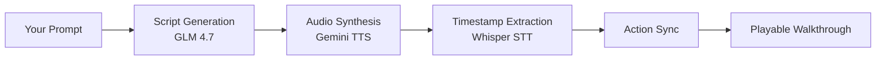

Get VSpeak running locally and watch your first AI-narrated coding walkthrough.

## Prerequisites

Before you begin, make sure you have:

- **Python 3.11+** installed
- **Node.js 18+** installed  
- **API keys** for your chosen providers (see [Installation](/installation) for details)

<Note>
VSpeak comes with a preloaded demo walkthrough, so you can see it in action immediately after starting the servers.
</Note>

## Quick Setup

<Steps>
  <Step title="Clone the repository">
    ```bash
    git clone https://github.com/utopianguide/VSpeak.git
    cd VSpeak
    ```
  </Step>

  <Step title="Configure environment">
    Create a `.env` file in the `backend/` directory:

    ```bash backend/.env
    # Required API keys
    CEREBRAS_API_KEY=your_cerebras_key
    GROQ_API_KEY=your_groq_key
    GEMINI_API_KEY=your_gemini_key
    ```

    <Tip>
    Get API keys from:
    - [Cerebras](https://cloud.cerebras.ai/) - For LLM script generation
    - [Groq](https://console.groq.com/) - For Whisper STT
    - [Google AI Studio](https://aistudio.google.com/) - For Gemini TTS
    </Tip>
  </Step>

  <Step title="Install dependencies">
    <CodeGroup>
      ```bash Windows
      # One command setup
      cd backend && pip install -r requirements.txt && cd ../web && npm install
      ```

      ```bash Linux/Mac
      # Backend
      cd backend
      pip install -r requirements.txt

      # Frontend
      cd ../web
      npm install
      ```
    </CodeGroup>
  </Step>

  <Step title="Start the servers">
    <Tabs>
      <Tab title="Windows">
        ```bash
        # From the project root
        ./start-dev.bat
        ```
        This starts both backend (port 8000) and frontend (port 3000) automatically.
      </Tab>
      
      <Tab title="Linux/Mac">
        Open two terminal windows:

        ```bash Terminal 1: Backend
        cd backend
        uvicorn server:app --host 0.0.0.0 --port 8000 --reload
        ```

        ```bash Terminal 2: Frontend
        cd web
        npm run dev
        ```
      </Tab>
    </Tabs>
  </Step>

  <Step title="Open VSpeak">
    Navigate to [http://localhost:3000](http://localhost:3000) in your browser.

    You'll see the VSpeak IDE with a preloaded demo walkthrough ready to play!
  </Step>
</Steps>

## Try the Demo Walkthrough

When you first open VSpeak, you'll see a demo conversation in the chat panel:

1. **Click the Play button** in the Walkthrough Player (top of right panel)
2. **Watch the magic happen**:
   - AI voice narrates what it's building
   - Code types itself in the editor in perfect sync
   - Files get created automatically
   - Terminal commands execute on cue

3. **Try the controls**:
   - ⏸️ **Pause** to read the code
   - ⏩ **Jump to chapters** by clicking the timeline
   - 🔄 **Reset** to watch again

<Tip>
The demo walkthrough demonstrates all VSpeak features: animated typing, chapter navigation, terminal integration, and audio-visual synchronization.
</Tip>

## Generate Your First Walkthrough

Now create a custom walkthrough:

1. **Type a prompt** in the chat input at the bottom of the right panel:
   ```
   Show me how to build a React counter component
   ```

2. **Wait for generation** (~15-30 seconds):
   - Script generation: ~2-5s
   - Audio synthesis: ~5-10s  
   - Timestamp extraction: ~3-8s
   - Action synchronization: &lt;1s

3. **Play your walkthrough** when generation completes

### Example Prompts to Try

<CardGroup cols={2}>
  <Card title="Web Development" icon="globe">
    "Create a responsive navbar with dropdown menu"
  </Card>
  
  <Card title="Backend APIs" icon="server">
    "Build a REST API with authentication in Flask"
  </Card>
  
  <Card title="React Components" icon="react">
    "Show me how to use React hooks for state management"
  </Card>
  
  <Card title="Data Processing" icon="database">
    "Write a Python script to parse CSV and export JSON"
  </Card>
</CardGroup>

## What's Happening Behind the Scenes?

When you request a walkthrough, VSpeak runs a 4-stage pipeline:



<Accordion title="Pipeline Details">
  1. **Script Generation**: LLM creates a narrated script with embedded IDE actions
  2. **Audio Synthesis**: Text-to-speech converts the script to voice audio
  3. **Timestamp Extraction**: Speech-to-text extracts word-level timestamps  
  4. **Action Synchronization**: Actions are matched to their trigger words in the audio

  See [Pipeline Concepts](/concepts/pipeline) for technical details.
</Accordion>

## Common Issues

<AccordionGroup>
  <Accordion title="Port 3000 or 8000 already in use">
    Kill the existing process or change ports:
    
    ```bash
    # Backend: Edit backend/server.py, change port 8000 to 8001
    # Frontend: Edit web/vite.config.ts, change port 3000 to 3001
    ```
  </Accordion>

  <Accordion title="API key errors">
    Make sure your `.env` file is in the `backend/` directory (not the project root) and contains valid keys:
    
    ```bash
    cd backend
    cat .env  # Should show your API keys
    ```
  </Accordion>

  <Accordion title="Module not found errors">
    Reinstall dependencies:
    
    ```bash
    cd backend && pip install -r requirements.txt
    cd ../web && npm install
    ```
  </Accordion>

  <Accordion title="Frontend can't connect to backend">
    Check that:
    - Backend is running on port 8000
    - No CORS errors in browser console
    - `http://localhost:8000/api/health` returns `{"status":"healthy"}`
  </Accordion>
</AccordionGroup>

## Next Steps

<CardGroup cols={2}>
  <Card title="Configuration" icon="sliders" href="/configuration/providers">
    Switch between AI providers and customize settings
  </Card>
  
  <Card title="Features" icon="sparkles" href="/features/walkthrough-generation">
    Learn about chapters, IDE actions, and customization
  </Card>
  
  <Card title="API Reference" icon="code" href="/api/overview">
    Integrate VSpeak into your own applications
  </Card>
  
  <Card title="User Guides" icon="book-open" href="/guides/creating-walkthroughs">
    Master VSpeak with step-by-step guides
  </Card>
</CardGroup>
